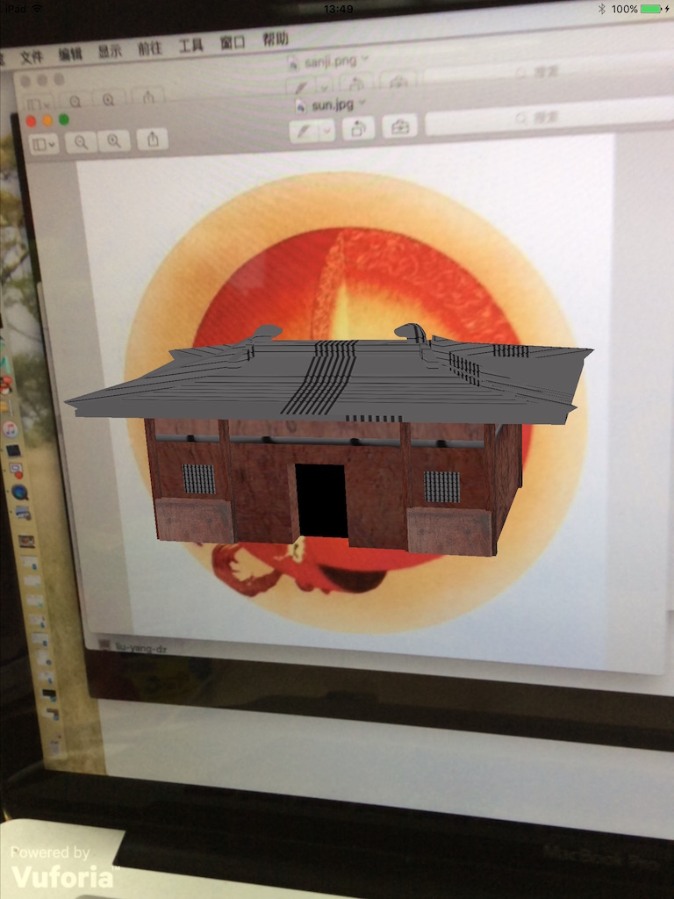

# Vuforia-iOS-Lib

This is a static library based on [Vuforia](https://developer.vuforia.com/), make AR application on iOS easier. It supports **Obj** model loading and basic controlling.

## USAGE

### PREREQUISITE
Download the [Vuforia SDK for iOS](https://developer.vuforia.com/downloads/sdk) and upack it to the `external-deps` folder. 
### ARDemo
If you wanna see the demo, follow steps below:  

1. Create a Vuforia license key
	- follow steps [here](https://developer.vuforia.com/library/articles/Solution/How-To-Create-an-App-License), you can get a **Starter** plan free of charge after registeration.
	
2. Copy your License key to the right place (a value of `AR_CONFIG_INIT_FLAG` key) in **AppDelegate.m**
3. Run the *ARDemo* target of project **ARDemo**

### ARLib
If you wanna create a static library, Run the *createARLib* target of project **ARDemo**. This create the necessary resources, including **a bundle**, **a header file** and **a static lib**, in the directory `output`.

Run the **TestARLib** project to test the lib.   Don't forget to copy your License Key firstly.

## CUSTOMIZE
You can customize the app with a confiuration, which is need when instantiating `ARViewController`. Datasets and models configuration are supported.

- `AR_CONFIG_DATA_SETS` : to configure datasets
- `AR_CONFIG_MODEL` : to configure 3D models

## FAQ
Camera view distorts when rotating device?  
	- Actually the rotaion is locked in the ViewController, if it donesn't work in Xcode 7, you can try to click `Requires full screen` in **General** pannel of xcode.

## UPDATE
### V2.0.0
1. Loading models in background;
2. Add exit protocol;
3. Support simutaneous targets;
4. Support illumination model; 

## ARTICLE
[Vuforia在iOS上的再封装](http://my.oschina.net/chicboi/blog/712515)